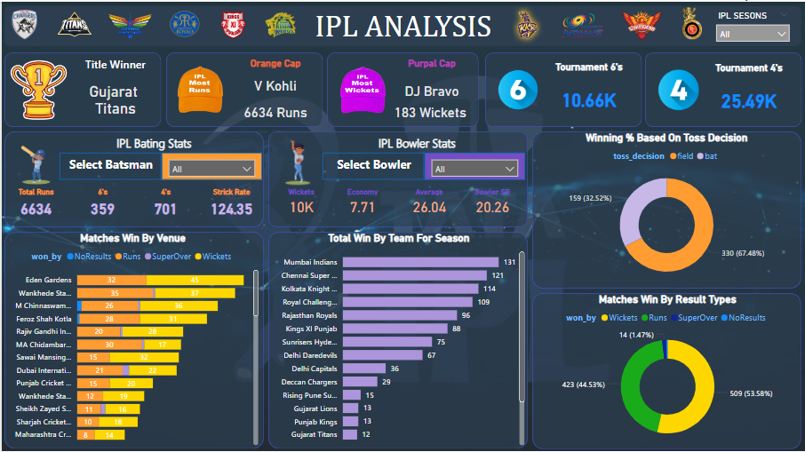

# Introduction

The Indian Premier League (IPL) is one of the most popular and competitive T20 cricket leagues in the world. Since its inception in 2008, it has attracted a global audience and featured many of the best cricketers. This project aims to analyze IPL data from 2008 to 2020 to uncover interesting trends, insights, and patterns.

# Problem Statements

1. Which teams have been the most successful in IPL history?

2. Who are the top-performing batsmen and bowlers?

3. How does the performance vary by venue?

4.  What factors contribute to a team's success in a match?

5.  How has the IPL evolved over the years in terms of competitiveness and player performance?

# Data Source

The dataset used for this analysis includes match data from IPL seasons 2008 to 2020. The data consists of various attributes such as match dates, teams, scores, venues, and player performances.

# Analysis & Visualization

## Data Cleaning and Preparation

The data cleaning is performed in Excel.

## Visualization & Dashboard Designe

we calculated the following key metrics:

### Team Performance Analysis

- Winning percentages of teams over the years.

- Comparison of teams based on the number of championships won.

### Player Performance Analysis

- Top batsmen by total runs scored.

- Top bowlers by total wickets taken.

- Player performance by season.

###  Venue Analysis

- Match outcomes based on venue.

-  Venue-specific performance trends for teams and players.

### Match Outcome Factors
- Impact of toss decisions on match outcomes.

- Performance analysis of teams batting first vs. chasing.

# Tools and Technologies Used

- Excel
- POWER BI

# Conclusion

### The IPL data analysis from 2008 to 2020 reveals several key insights:

 -  ### Team Performance: 
Teams like Mumbai Indians and Chennai Super Kings have consistently performed well, winning multiple championships.

- ### Player Performance: 
Prominent batsmen such as Virat Kohli and bowlers like Lasith Malinga have shown exceptional performance throughout the seasons.

- ### Venue Influence: 
Certain venues like the Wankhede Stadium in Mumbai and Chinnaswamy Stadium in Bangalore have unique characteristics that influence match outcomes.

- ### Match Factors:
Toss decisions, especially choosing to field first, often play a crucial role in the match results. Teams chasing targets generally have a slight advantage.

# Recommendations

- ### Team Strategies:
Teams should analyze historical performance data and tailor their strategies according to opponent strengths and weaknesses.

- ### Player Selection:
 Investing in consistent performers and emerging talents can bolster team strength. Rotating players based on venue-specific performances can also be beneficial.

- ### Venue-specific Approaches: 
Teams should adapt their strategies to suit the unique conditions of different venues, such as pitch behavior and weather conditions.

- ### Toss Decisions:
 Given the advantage of chasing, teams may prefer to field first upon winning the toss, especially in conditions conducive to batting second.

## Acknowledgements

- Data sourced from Kaggle
- IPL official website for additional information and context
